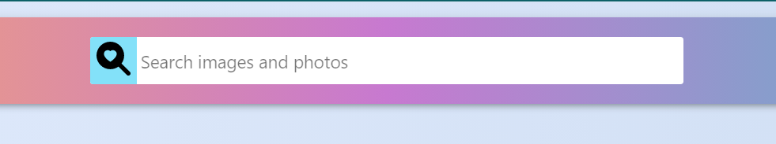
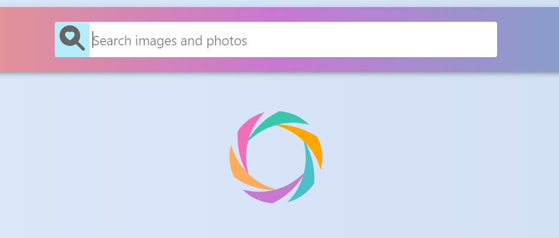
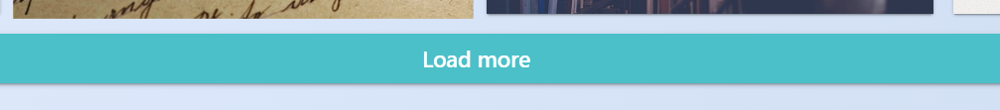
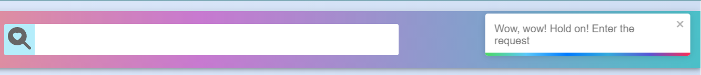
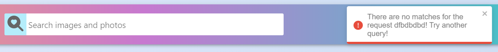

# React Homework - 3 - Image Finder

Now you can easily find images on demand! With an app "Image Finder".

## The project used:

`«React»`
`«Javascript»`
`«React Icons / library»`
`«Pixabay / library»`
`«react-loader-spinner / npm»`
`«react-toastify / npm»`
`«prop-types / npm»`

Used assembly: [React project template](https://github.com/goitacademy/react-homework-template#readme)

## Project structure

Search bar. Finding images is now easy!

While the images are loading, a spinner appears on the screen.

Image gallery.

Image load more button.

Interactive notificationsю

